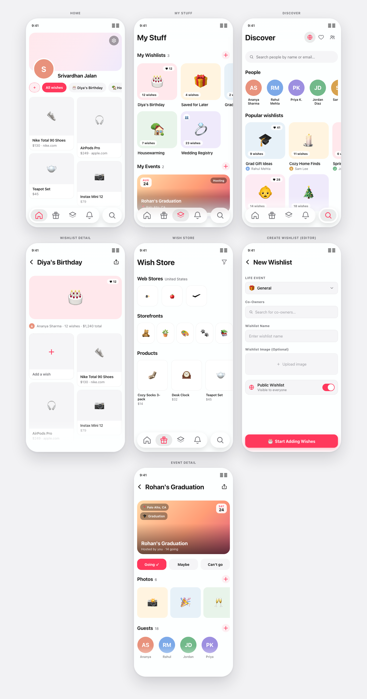
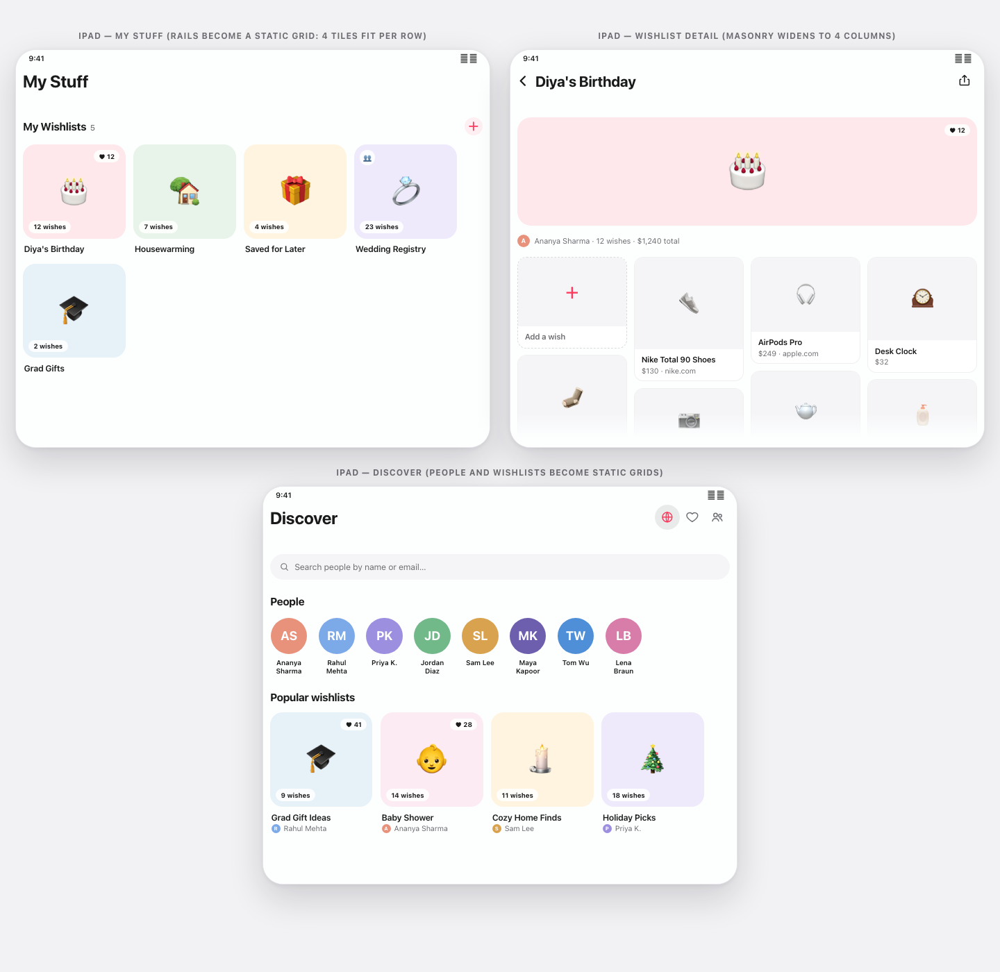
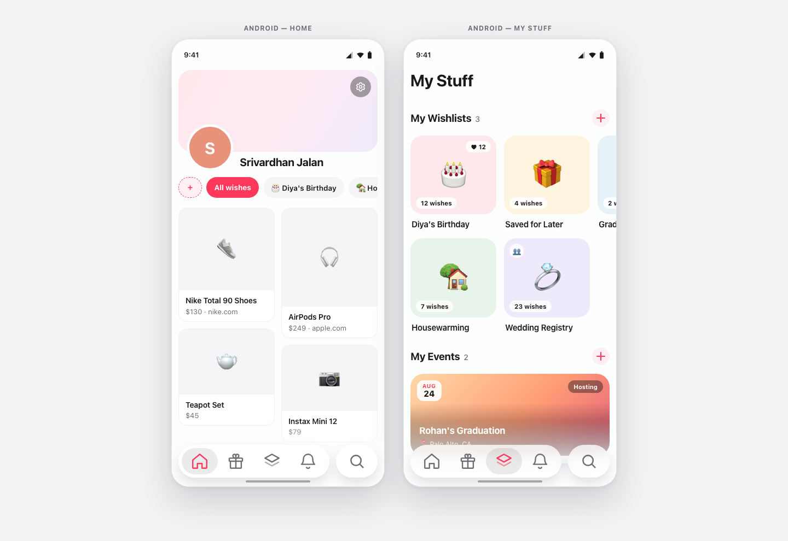

# Kivan — Build a Production Social-Wishlist App

**One codebase. iPhone, iPad, Android, and web — in any country.** Kivan is a
real product, not a toy example: create wishlists for life's moments, add
wishes by browsing real stores inside the app (the store directory adapts to
your country, and prices are scraped in whatever currency each store sells —
₹, $, £, €, AED and more), follow friends, plan events around wishlists with
RSVPs and email invites, and get notified in-app and by email — all on live
AWS infrastructure you deploy yourself.

*This repository pairs with the **[Zero to Shipped](https://medium.com/@srivardhanjalan/zero-to-shipped-2c13ce7e20e9)**
series on Medium — one post per step.*



*Every screen above is rendered from the app's real design tokens — the
translucent header wash, adaptive tile rails, device-aware masonry, and the
floating glass tab bar.*

**What you'll have built by the end:**

- A polished **Expo / React Native** app (iOS + iPad + Android + web) with a
  token-driven design system and adaptive layouts
- A **FastAPI** backend on **AWS App Runner** with JWKS-verified Clerk auth,
  just-in-time user provisioning, and DynamoDB single-table-per-feature design
- **Terraform** for the entire stack — ECR, App Runner, DynamoDB, S3 with a
  backend-owned photo lifecycle, SQS → Lambda notifications, Mailgun email,
  CloudWatch alarms, budgets
- An **admin dashboard**, deep-link sharing, and CI/CD references

**Who this is for:** you're comfortable in a terminal and have written some
JavaScript or Python. You do *not* need to know React Native, FastAPI,
Terraform, or AWS — every step explains what it's doing and why. Budget
roughly an evening per step; every step ends with something that runs.

## One codebase, every device

The same code on iPad — rails become static grids, masonry widens to four
columns, all from device-driven layout math (no iPad-specific screens):



And on Android — the identical app with Android system chrome:



*Interactive versions: open [`mocks/iphone.html`](mocks/iphone.html),
[`mocks/ipad.html`](mocks/ipad.html), or [`mocks/android.html`](mocks/android.html)
in a browser.*

## Why this tutorial is different: the jigsaw principle

The app is split into a domain-agnostic **platform** (shell & design system,
auth, profiles, media, social, notifications, sharing, admin, operations) and
swappable **domain modules** 🧩 (collections, storefronts, browser acquisition,
events). The modules plug into the platform like jigsaw pieces — `final/MODULES.md`
documents each piece's contract so you can replace *wishlists + wish stores*
with *notes*, *trips + destinations*, or any collection-shaped domain of your
own. You're not just building Kivan; you're building a platform you can reuse.

**How the repository works:**

- **One folder per step**, named for what it builds (`01-prerequisites` …
  `16-operations`). `01-prerequisites` sets up your machine and accounts; every
  folder from `02-app-shell` on is a **complete, runnable, deployable
  snapshot** — you never need another folder to run a step.
- **Each step lands as two pull requests** (after a *baseline* commit that
  copies the previous step's folder straight to main): a **code PR** — whose
  *Files changed* view **is** what the feature costs, browsable, commentable,
  linkable — and a small **content PR** with the step's Medium post and
  imagery. Squash-merges keep main's history clean; each step's README links
  its code PR.
- **`final/`** (last commit) is the complete application.
- **Zero bloat, mechanically enforced**: every step contains exactly the code
  that stage needs. `tools/audit-step.sh <step>` is the pre-PR gate — tsc,
  dead-export analysis (knip), and a color-literal report — run repeatedly
  until it finds nothing, because deleting dead code orphans other code.

## The steps

| Folder | You build | You can then |
|---|---|---|
| `01-prerequisites` | Run `./setup.sh` + the accounts list | verify your machine is ready |
| `02-app-shell` | App shell & design system — config (name, scheme, theme, tabs), liquid-glass chrome, shared components | run a fully themed app standalone |
| `03-backend-core` | Backend & infra core — FastAPI skeleton, Terraform (ECR, App Runner, monitoring base), the amd64 deploy loop | see the app talk to your live AWS backend |
| `04-auth` | Auth & onboarding — Clerk sign-in/up (email, Google, Apple), JWKS verification, just-in-time user provisioning, roles foundation, first-run tutorial | create real accounts end-to-end |
| `05-profiles` | Profiles — profile data, birthday, Settings, account deletion | manage a real user profile |
| `06-media` | Media — S3 photos with backend-owned lifecycle (pending upload → claim on save → auto-expiry), profile & cover photos | upload photos safely, orphan-free |
| `07-collections` | 🧩 Collections — wishlists & wishes, life-events, Home/My Stuff/detail/create screens | keep real wishlists |
| `08-storefronts` | 🧩 Storefronts — curated stores with products | add wishes from a curated catalog |
| `09-browser` | 🧩 Browser acquisition — brand directory, in-app browser, product scrapers, multi-currency prices | add wishes from real store websites |
| `10-social` | Social — follow graph, Discover, public profiles, loves | build your network |
| `11-notifications` | In-app notifications — SQS → Lambda pipeline, notification screens, per-type mutes | get notified about social activity |
| `12-email` | Email notifications — Mailgun delivery leg, per-user opt-in, delivery-time checks | receive email copies of notifications |
| `13-events` | 🧩 Events — gatherings around wishlists: RSVP, hosts, guest invites (incl. email invites for non-users), multi-photo galleries | see the full delta of integrating a feature into notifications & media |
| `14-sharing` | Sharing — `kivan://` deep links + the share-modal family | share wishlists, profiles, events |
| `15-admin` | Admin — role enforcement + an admin dashboard (brands, life events, storefronts & products, users) | operate the app's catalog |
| `16-operations` | Operations — CloudWatch alarms & dashboards, cost management, CI/CD references | run it like production |
| `final/` | The complete application | the finished product + `MODULES.md` |

## Prerequisites

Step 01 is its own folder — [`01-prerequisites/`](01-prerequisites/) — with the full walkthrough:

```bash
cd 01-prerequisites && ./setup.sh
```

The script is idempotent (installs only what's missing, Homebrew included)
and covers the whole toolchain: Node, Python 3.12, Terraform, the AWS CLI,
Docker/Colima — including the Apple-Silicon-safe amd64 build profile that App
Runner requires. [`01-prerequisites/README.md`](01-prerequisites/README.md) then lists the few
accounts a script can't create for you — [AWS](https://aws.amazon.com)
(≈ $5–10/month while deployed; `terraform destroy` stops all charges),
[Clerk](https://dashboard.clerk.com) (auth),
[Firecrawl](https://firecrawl.dev) (scraping), and optionally
[Mailgun](https://www.mailgun.com) and Apple Sign-In — with exact
click-paths, plus the
secrets hygiene rules every later step relies on. Want Android too?
`./setup.sh --android` scripts the whole toolchain (JDK, SDK, a Pixel 8
emulator) — no Android Studio required.

## Working through the steps

```bash
cd 01-prerequisites   # README + ./setup.sh: machine and accounts ready
cd 02-app-shell       # each step from here: README first, then build & run
…
```

Every step from 03 onward ends with a deployable state: `terraform apply`,
push the backend image, run the app, and verify the step's checklist before
moving on. When something breaks, each README has a *Gotchas* section with the
failure modes we hit for real while building this.
