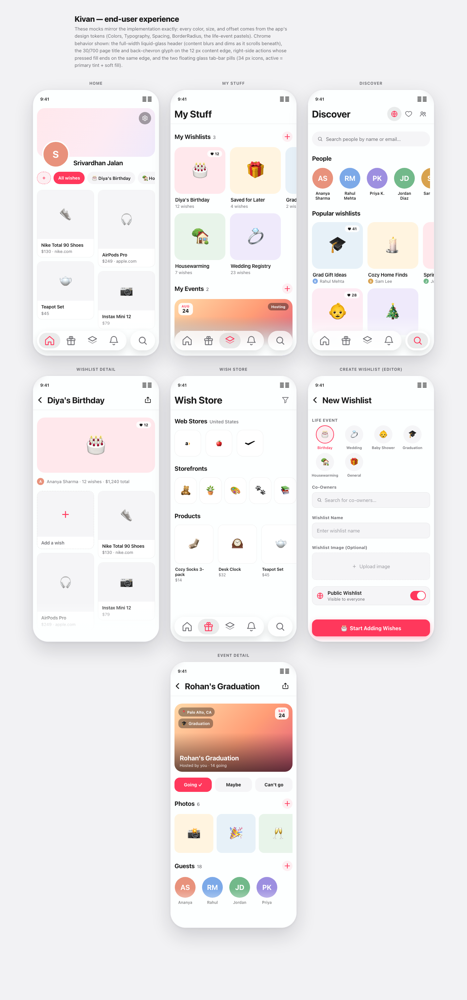

# Kivan — Build a Production Social-Wishlist App, Step by Step

Kivan is a social wishlist app: create wishlists, add wishes by browsing real
stores in-app, follow friends, plan events around wishlists, and get notified
in-app and by email. This repository teaches you to build and deploy it —
frontend (Expo/React Native), backend (FastAPI on AWS App Runner), and
infrastructure (Terraform) — in **16 self-contained steps**.

## How this repository works

- **One folder per step** (`step-01` … `step-16`), each a **complete, runnable,
  deployable snapshot** of the app at that stage. You never need another folder
  to run a step.
- **One commit per step**, in order — the git history *is* the curriculum.
  `git diff` between adjacent steps shows exactly what a feature costs.
- **`final/`** (last commit) is the complete application.
- **Zero bloat**: every step contains exactly the code that stage needs —
  nothing unused, nothing speculative.

### The jigsaw principle

The app is split into a domain-agnostic **platform** (shell & design system,
auth, profiles, media, social, notifications, sharing, admin, operations) and
swappable **domain modules** 🧩 (collections, storefronts, browser acquisition,
events). The modules plug into the platform like jigsaw pieces — `final/MODULES.md`
documents each piece's contract so you can replace *wishlists + wish stores*
with *notes*, *trips + destinations*, or any collection-shaped domain of your own.

## What you're building

Pixel-accurate mocks of the end experience, rendered with the app's exact
design tokens and chrome — the liquid-glass header, edge-aligned titles and
actions, adaptive tile rails, masonry, event cards, and the floating glass
tab bar. (Interactive version: open [`mocks/index.html`](mocks/index.html)
in a browser.)



## The steps

| Step | You build | You can then |
|---|---|---|
| 01 | Prerequisites — run `./setup.sh` (installs everything missing, skips what's present) | verify your machine is ready |
| 02 | App shell & design system — config (name, scheme, theme, tabs), liquid-glass chrome, shared components | run a fully themed app standalone |
| 03 | Backend & infra core — FastAPI skeleton, Terraform (ECR, App Runner, monitoring base), the amd64 deploy loop | see the app talk to your live AWS backend |
| 04 | Auth & onboarding — Clerk sign-in/up (email, Google, Apple), JWKS verification, just-in-time user provisioning, roles foundation, first-run tutorial | create real accounts end-to-end |
| 05 | Profiles — profile data, birthday, Settings, account deletion | manage a real user profile |
| 06 | Media — S3 photos with backend-owned lifecycle (pending upload → claim on save → auto-expiry), profile & cover photos | upload photos safely, orphan-free |
| 07 | 🧩 Collections — wishlists & wishes, life-events, Home/My Stuff/detail/create screens | keep real wishlists |
| 08 | 🧩 Storefronts — curated stores with products | add wishes from a curated catalog |
| 09 | 🧩 Browser acquisition — brand directory, in-app browser, product scrapers, multi-currency prices | add wishes from real store websites |
| 10 | Social — follow graph, Discover, public profiles, loves | build your network |
| 11 | In-app notifications — SQS → Lambda pipeline, notification screens, per-type mutes | get notified about social activity |
| 12 | Email notifications — Mailgun delivery leg, per-user opt-in, delivery-time checks | receive email copies of notifications |
| 13 | 🧩 Events — gatherings around wishlists: RSVP, hosts, guest invites (incl. email invites for non-users), multi-photo galleries | see the full delta of integrating a feature into notifications & media |
| 14 | Sharing — `kivan://` deep links + the share-modal family | share wishlists, profiles, events |
| 15 | Admin — role enforcement + an admin dashboard (brands, life events, storefronts & products, users) | operate the app's catalog |
| 16 | Operations — CloudWatch alarms & dashboards, cost management, CI/CD references | run it like production |
| `final/` | The complete application | the finished product + `MODULES.md` |

## Prerequisites

**The fast path — one script does it all:**

```bash
./setup.sh
```

It installs everything that's missing (including Homebrew itself), skips
everything already present, and is safe to re-run. It ends with a short list
of the few things a script can't do for you — installing Xcode from the App
Store, `aws configure`, and creating the accounts below.

The tables that follow are the manual reference for what the script covers.

### Machine & tooling (required)

| What | How to resolve |
|---|---|
| **macOS with Xcode + iOS Simulator** | Install Xcode from the App Store → open it once → `xcode-select --install` → Xcode ▸ Settings ▸ Components: install an iOS simulator runtime |
| **Node.js 20+** | `brew install node` (or `nvm install 20`) |
| **Python 3.11 or 3.12** | `brew install python@3.12` — *3.13+/3.14 will not install the pinned pydantic; use 3.12 for the backend venv* |
| **Terraform** | `brew tap hashicorp/tap && brew install hashicorp/tap/terraform` |
| **Docker + Colima with Rosetta** | `brew install colima docker docker-buildx` → `softwareupdate --install-rosetta --agree-to-license` → `colima start rosetta --vm-type vz --vz-rosetta --arch aarch64 --cpu 4 --memory 6`. **Apple Silicon warning:** App Runner images must be built through Rosetta with the *docker* driver (`docker buildx build --builder colima-rosetta …`) — QEMU emulation and docker-container builders produce images that pass locally but fail on App Runner with `CREATE_FAILED` and no logs. Step 03 walks through this. |
| **AWS CLI** | `brew install awscli` → `aws configure` with an access key |
| **Android Studio** *(optional)* | Only if you want the Android emulator; every step also runs on iOS + web |

### Accounts & keys

| What | Needed from step | How to resolve |
|---|---|---|
| **AWS account** | 03 | [aws.amazon.com](https://aws.amazon.com) → create account → IAM ▸ Users ▸ create user with `AdministratorAccess` (tutorial scope) → create access key → `aws configure`. Expect roughly **$5–10/month** while deployed (App Runner is the main cost); step 16 adds budgets and alarms, and `terraform destroy` stops all charges. |
| **Clerk** (auth) | 04 | [dashboard.clerk.com](https://dashboard.clerk.com) → Create application → enable **Email** and **Google** sign-in → API Keys: copy the **Publishable key** (frontend `.env.local`) and **Secret key** (`infra/terraform.tfvars`) |
| **Apple Sign-In** *(optional)* | 04 | Requires a paid Apple Developer Program membership; configure the App ID + key per step 04's README. Skippable — email/Google auth works without it. |
| **Firecrawl** (scraping) | 09 | [firecrawl.dev](https://firecrawl.dev) → sign up → copy the API key (`fc-…`) into `infra/terraform.tfvars` |
| **Mailgun** *(optional, email)* | 12 | [mailgun.com](https://mailgun.com) → sign up → copy the sandbox domain + API key into `infra/terraform.tfvars`. **Sandbox domains only deliver to "authorized recipients"** you add in the dashboard — fine for testing. For real delivery: Sending ▸ Domains ▸ add a domain you own and publish its SPF/DKIM DNS records. Leave the keys empty to disable email entirely — everything else still works. |

### Secrets hygiene

Secrets live in two gitignored files, never in code:
`frontend/.env.local` (Clerk publishable key, API URL) and
`infra/terraform.tfvars` (Clerk secret, Firecrawl, Mailgun). Each step's README
shows the exact entries it needs.

## Working through the steps

```bash
cd step-01   # read its README, run check-setup.sh
cd step-02   # each step: README first, then build & run
…
```

Every step from 03 onward ends with a deployable state: `terraform apply`,
push the backend image, run the app, and verify the step's checklist before
moving on. When something breaks, each README has a *Gotchas* section with the
failure modes we hit for real while building this.
