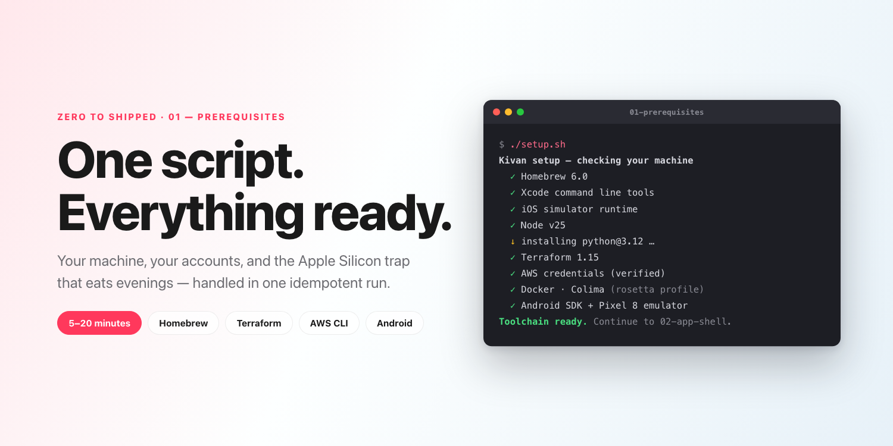
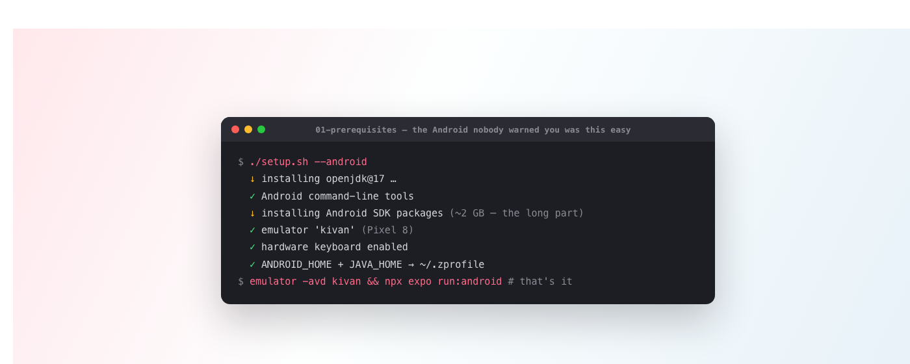
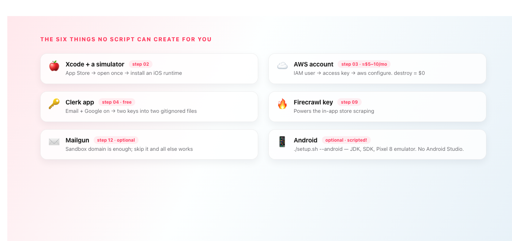

# One Script to Set Up Everything

*Zero to Shipped · 01 — your machine, your accounts, and the Apple Silicon trap that eats evenings.*

---



This is step 01 of **Zero to Shipped**, a series where we build a real social product — iPhone, iPad, Android, and a live AWS backend — one deployable step at a time. New here? **[Start with the introduction](https://medium.com/@srivardhanjalan/zero-to-shipped-2c13ce7e20e9)** for what we're building and why the architecture is worth stealing. The code lives at **[github.com/srivardhanjalan/kivan-tutorial](https://github.com/srivardhanjalan/kivan-tutorial)**; this post is the `01-prerequisites/` folder.

By the end of this post your machine can build and deploy everything in the series, and you'll know exactly which accounts you need (and what they cost: about **$5–10/month** while deployed, and `terraform destroy` stops all charges).

## One script does almost everything

```bash
cd 01-prerequisites && ./setup.sh
```

It's idempotent — it installs **only what's missing** and skips the rest, so it's safe to re-run any time. It covers Homebrew itself (if you've never installed it), the Xcode command line tools, Node.js 20+, Python 3.12, Terraform, the AWS CLI (and verifies your credentials actually work), Docker + Colima + buildx + watchman, and — on Apple Silicon — Rosetta 2 with a correctly configured build profile.

That last one deserves a sentence, because it will save someone a lost evening: **AWS App Runner only runs amd64 images, and on Apple Silicon the obvious ways of building them are broken.** QEMU emulation and docker-container builders produce images that build fine locally and then fail on AWS with `CREATE_FAILED` and no logs. The script configures the one path that works — a Rosetta-backed Colima profile with the plain docker driver — and step 03 explains the why.

Want Android too? The script handles the entire toolchain — no Android Studio required:

```bash
./setup.sh --android
```



That installs the JDK, the Android SDK, and creates a ready-to-boot Pixel 8 emulator named `kivan` (~2 GB). Then it's `emulator -avd kivan` and `npx expo run:android` in any step's `frontend/`. Nothing else in the series changes.

When the script finishes, it prints exactly what's still yours to do. Which is this list:

## The things a script can't do for you



1. **Xcode + an iOS simulator** *(needed at step 2)* — install [Xcode from the App Store](https://apps.apple.com/app/xcode/id497799835), open it once, then Settings ▸ Components ▸ install an iOS simulator runtime.
2. **An AWS account + credentials** *(step 3)* — [create an account](https://aws.amazon.com), create an IAM user with `AdministratorAccess` (fine for a tutorial account), create an access key, run `aws configure`. **Cost while deployed: roughly $5–10/month**, dominated by App Runner. Step 16 adds budgets and alarms, and `terraform destroy` stops all charges the moment you're done.
3. **A Clerk application** *(step 4, free)* — this is the auth provider. Create an app at [dashboard.clerk.com](https://dashboard.clerk.com), toggle Email and Google on, and copy two keys into two gitignored files.
4. **A Firecrawl API key** *(step 9)* — [firecrawl.dev](https://firecrawl.dev) powers the product scraping.
5. **[Mailgun](https://www.mailgun.com)** *(step 12, optional)* — a sandbox domain is enough to see email notifications work; skip it entirely and everything else still runs.
6. **Apple Sign-In** *(step 4, optional)* — needs the paid [Apple Developer Program](https://developer.apple.com/programs/). Email + Google auth is complete without it.

## Secrets hygiene, from day one

Secrets live in exactly two gitignored files, never in code: `frontend/.env.local` (the Clerk publishable key and API URL) and `infra/terraform.tfvars` (the Clerk secret, Firecrawl, and Mailgun keys). Every step's README shows the exact entries it needs and nothing more.

## You're done when

- `./setup.sh` shows a green ✓ for every tool — the only items it leaves you are the accounts above
- Xcode opens and an iPhone simulator boots
- `aws sts get-caller-identity` prints your account
- Your Clerk keys exist (Firecrawl and Mailgun can wait until their steps)

## What's next

In **step 02**, we build the app shell and design system — the config files that name the product, the design tokens every screen draws from, and the shared components that make eleven screens feel like one app. It runs standalone, with no backend at all, and it's where the jigsaw principle starts paying rent: by the end of it, renaming Kivan to your own product is a one-file change.

**Following along?** ⭐ [Star the repo](https://github.com/srivardhanjalan/kivan-tutorial) and follow me here so step 02 lands in your feed.

---

**Zero to Shipped — the series**

- **00 · [Introduction](https://medium.com/@srivardhanjalan/zero-to-shipped-2c13ce7e20e9)**
- **01 · Prerequisites: one script to set up everything** *(this post)*
- **02 · App shell & design system** *(coming soon)*

*All code: [github.com/srivardhanjalan/kivan-tutorial](https://github.com/srivardhanjalan/kivan-tutorial)*
