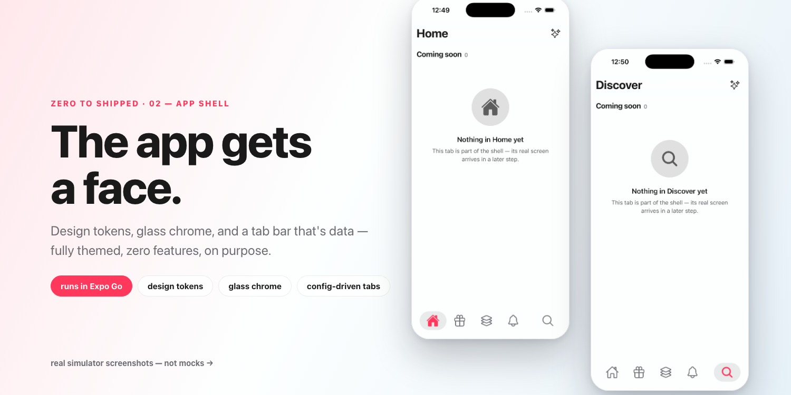
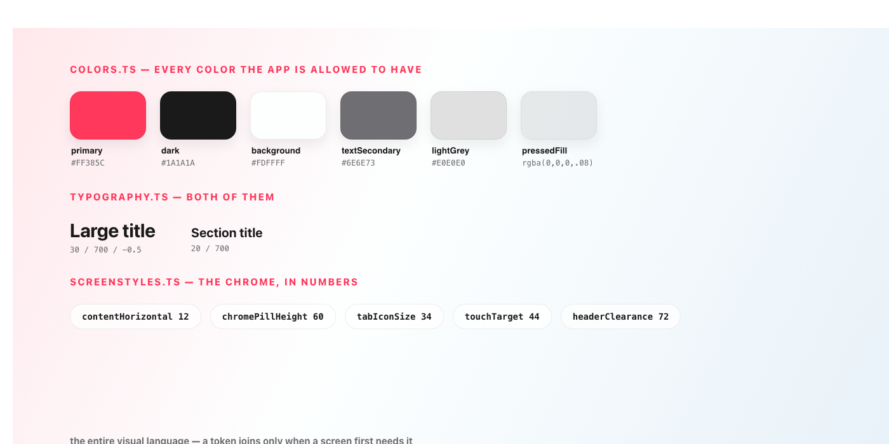
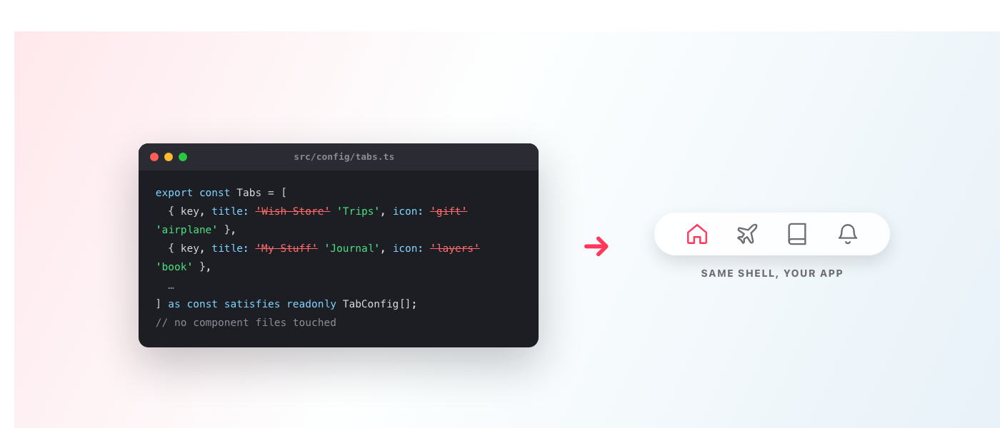

# Dressed to Ship

*Zero to Shipped · 02 — design tokens, glass chrome, and a tab bar that's data: a fully themed app with zero features, on purpose.*

---



Today we build an app that does nothing.

Not "a simple app." Nothing. Five tabs, and every one of them politely tells you its real screen hasn't arrived yet. If you demoed it to a friend they'd ask when you're going to start.

Here's my claim: this is the most important step in the series — and if you skip it, you'll spend week six of your project doing what I used to do, which is opening eleven screens one by one to fix the same padding.

*(This is step 02 of **Zero to Shipped**, where we build a real social product one deployable step at a time. New here? **[Start with the introduction](https://medium.com/@srivardhanjalan/zero-to-shipped-2c13ce7e20e9)**. The code is the `02-app-shell/` folder; [PR #7](https://github.com/srivardhanjalan/kivan-tutorial/pull/7/files) shows every line.)*

## Consistency isn't a habit, it's a jail you build for your future self

Every app you admire has one property tutorials never teach: every screen looks like the same person made it. That doesn't come from discipline. Discipline is what you have in week one. It comes from locking the door: make inconsistency impossible and you never have to resist it.

- **Every visual decision is a token.** Colors, type, radii, shadows, and the chrome's spacing metrics (`ScreenStyles.ts`) live in `src/constants/`; screens import them, and no screen ever invents a hex value. When we build real screens later, they'll look like this shell because they physically can't look like anything else.
- **The chrome is shared, not copied.** One floating header, one screen scaffold, one tab bar. Components compose them; nobody re-implements them.
- **The app's identity is data.** The tab bar is literally an array in `config/tabs.ts`. Hold that thought — it gets a payoff at the end.

Run it (no backend, no accounts, no API keys — Expo Go and go):

```bash
cd 02-app-shell/frontend
npm install
npm run ios
```

## The tokens: fewer than you think



`src/constants/` is the whole visual language, and here's the part that surprises people: **Typography.ts contains two styles.** Not a "type scale." Two. The 30pt large title and the 20pt section title, because those are the only two styles this step *uses*.

That's the series' engineering rule doing its job: a token joins the file when a screen first needs it, never in advance. One radius (things that are fully round). Two shadow recipes: one for the chrome pills, one for things that float over them. Even the grey you feel when you press a button is a named token, `Colors.pressedFill`, because it appeared twice and a value that appears twice is a decision pretending to be a coincidence.

### How I got humbled by my own linter

Confession: the first version of this step didn't follow the rule. I copied the full constants files from the finished app — a radius scale, a shadow menu, a dozen text styles — because *obviously* later steps would need them.

Then I pointed the audit gate at it (types, dead-code analysis, clone detection, plus an AI reviewer told to hunt duplication by *meaning*), and it took **six rounds** to reach a clean pass. It found tokens with no callers. Then tokens whose only caller had just been deleted. Then a comment promising the spinner "defaults to the logo" while the code did no such thing. Then two names for the same concept. Every round I thought I was done; every round it found more. That day the step went from 1,670 lines to 829, rendering pixel-identical before and after. (It sits at 858 now — src plus App.tsx — after a later round added the pressed-fill token and friends. Clone it and count.)

The lesson stuck: **speculative code isn't foresight, it's inventory** — and inventory rots. Every file in this step is load-bearing, and the gate that enforces it ships in the repo (`tools/audit-step.sh`), so you can hold your own steps to it.

## The chrome: two moves you saw in the mocks

- **The floating header doesn't blur, doesn't draw a line.** It paints a translucent wash of the page background that eases to nothing — content scrolling under the title stays visible, just lighter. Apple's large-title feel without a `BlurView`.
- **The tab bar is two floating glass pills** — main tabs left, search in its own pill on the right. The active tab gets a soft pressed fill and a filled icon. That's the whole affordance language: if it responds to your finger, it fills grey.

Every tab mounts the same `PlaceholderScreen`, which exists to exercise the system end to end: a brief branded loading pulse, the header with a working action, a section header, an empty state, and a toast when you tap ✨. Zero features, every primitive proven.

## The payoff: rename the app in one edit

```ts
export const Tabs = [
  { key: 'HomeTab',          title: 'Home',          icon: 'home-outline',          iconActive: 'home' },
  { key: 'AddWishTab',       title: 'Wish Store',    icon: 'gift-outline',          iconActive: 'gift' },
  { key: 'MyStuffTab',       title: 'My Stuff',      icon: 'layers-outline',        iconActive: 'layers' },
  { key: 'NotificationsTab', title: 'Notifications', icon: 'notifications-outline', iconActive: 'notifications' },
] as const satisfies readonly TabConfig[];
```

That's the left pill (abridged — the search tab has its own `SearchTab` constant for the right pill, same file). `TabNavigation` renders whatever this config says. It has never heard of wishlists. Even the route-name union is *derived* from the config, so adding a tab types the whole navigator for free.

Which means you can steal the shell right now:

1. `app.json` → your `name` and `scheme`
2. `config/app.ts` → point `branding.spinnerLogo` at your mark; the loader rebrands itself
3. `config/tabs.ts` → `Trips`, `Journal`, whatever you're actually building



Reload. Your app, your tabs, not one component file touched. This is the jigsaw principle at its smallest scale — in step 07 the same trick starts swapping whole feature modules.

## Gotchas from the real run

- **Metro port conflicts.** Running two steps at once? Add `--port 8083`.
- **Watchman can't hurt you here** — `metro.config.js` opts into Metro's Node file watcher (`useWatchman: false`). On a project this size watchman adds no speed, only a failure mode (a stale daemon hangs Metro at "Waiting for Watchman"). One config line deletes the entire problem.
- **Expo Go tracks the newest SDK.** This project pins SDK 54 with a committed lockfile, so `npm install` gives you the exact working set. If Expo Go itself moves ahead months from now, `npx expo install --fix` realigns everything.
- **Physical phone instead of a simulator?** The npm scripts pass `--localhost` (immune to VPN/firewall weirdness on simulators); a real phone needs the LAN — `npm start` (flagless), same Wi-Fi.
- **`id={undefined}` on the navigator** — React Navigation v7's types demand an explicit `id` even when you don't want one. Deliberate; leave it.

## You're done when

- The app boots in Expo Go and shows five tabs in the glass pills
- Switching tabs moves the pressed fill and swaps outline → filled icons
- Each tab's title appears in the floating header
- The ✨ button fires a toast

## What's next

In **step 03**, the app leaves the simulator: a FastAPI skeleton, Terraform for real AWS infrastructure, and a deploy that failed on me twice in ways your laptop will never warn you about. Every tab's placeholder gains a heartbeat.

**Following along?** ⭐ [Star the repo](https://github.com/srivardhanjalan/kivan-tutorial) and follow me here so step 03 lands in your feed.

---

**Zero to Shipped — the series**

- **00 · [Introduction](https://medium.com/@srivardhanjalan/zero-to-shipped-2c13ce7e20e9)**
- **01 · [One script to set up everything](https://medium.com/@srivardhanjalan/one-script-to-set-up-everything-ae8bcea2d649)**
- **02 · Dressed to Ship** *(this post)*
- **03 · [Alive on Arrival](https://medium.com/@srivardhanjalan/alive-on-arrival-cda0a351844f)**

*All code: [github.com/srivardhanjalan/kivan-tutorial](https://github.com/srivardhanjalan/kivan-tutorial)*
