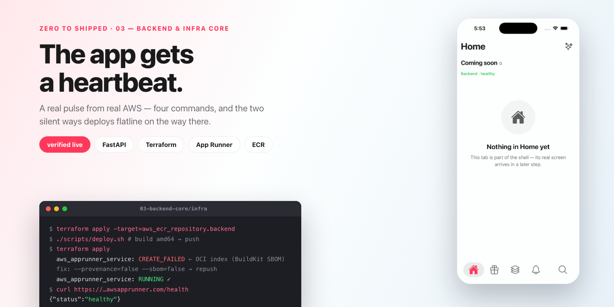

# The App Gets a Heartbeat

*Zero to Shipped · 03 — a real pulse from real AWS: four commands, FastAPI + Terraform + App Runner, and the two silent ways deploys flatline on the way there.*

---



While verifying this exact step, my deploy died like this: `terraform apply` waited three minutes on App Runner, returned `CREATE_FAILED`, and the service log group was **empty** — the container never produced a single line. The same image ran perfectly on my laptop. The API code was completely innocent. It took inspecting the pushed manifest to find the culprit, and it wasn't the one the internet warns you about.

That story — both versions of it — is the second half of this post. The first half is the payoff it interrupts: a FastAPI backend running on your own AWS, deployed with four commands, every resource tagged and grouped, torn down to zero with one.

*(This is step 03 of **Zero to Shipped**, where we build a real social product one deployable step at a time. New here? **[Start with the introduction](https://medium.com/@srivardhanjalan/zero-to-shipped-2c13ce7e20e9)**. The code is the `03-backend-core/` folder; [PR #12](https://github.com/srivardhanjalan/kivan-tutorial/pull/12/files) shows every line this step adds.)*

## The backend earns its dependencies

The FastAPI skeleton follows the same rule the frontend's design tokens do: nothing joins before its first caller.

```
backend/
  app/main.py            assembles the app: middleware + router includes + /
  app/routes/health.py   one domain per file — later routers land beside it
  run.py                 local dev server
  Dockerfile             python:3.11-slim — the exact image App Runner runs
  requirements.txt       fastapi + uvicorn. Two lines.
```

No database, no auth middleware, no queue — those arrive with the steps that consume them. `main.py` only assembles; every route lives in its own file under `app/routes/`, so the structure that will hold fifteen routers is already the structure that holds one.

## Infrastructure as code, one file per concern

```
infra/
  providers.tf        AWS provider with default_tags — every resource tagged
  ecr.tf              the registry + lifecycle policy (keep last 10 images)
  apprunner.tf        the service: health-checked on /health, auto-deploys :latest
  iam.tf              the two roles App Runner needs
  resource-group.tf   a tag-based group holding the whole stack
  variables.tf / outputs.tf / scripts/deploy.sh
```

Two disciplines here that pay off for the rest of the series:

- **Every resource is tagged and grouped.** The provider's `default_tags` stamps `Project` + `Environment` onto everything, and the resource group collects it all by tag query. One console page shows your entire stack — and proves when it's gone.
- **`terraform destroy` means zero.** We verified it: destroy, sweep the two log groups App Runner self-creates (the one resource Terraform can't own — their names embed a service ID that doesn't exist until the service does; `deploy.sh` tags them into the group), then a tag search across the account: **no resources remain**.

## The rollout — and the failure, twice

App Runner can't create a service from an empty registry, so the first rollout is staged:

```bash
terraform apply -target=aws_ecr_repository.backend   # 1. registry first
./scripts/deploy.sh                                   # 2. build amd64 → push
terraform apply                                       # 3. the service (~5 min)
./scripts/deploy.sh                                   # 4. instant re-run: tags the log groups
```

And now the story from the top of the post. **`CREATE_FAILED`, with empty logs** — the service dies before the first line of application output. Two completely different causes share this identical symptom:

1. **The wrong build path on Apple Silicon.** QEMU emulation and docker-container builders produce amd64 images that pass every local test and fail only on AWS. The fix is the Rosetta-backed Colima context that step 01's script configured (`docker context show` → `colima-rosetta`).
2. **BuildKit's default attestations** — and this one we hit *while verifying this exact step*. Newer Docker attaches provenance/SBOM manifests to a push, turning it into an OCI image *index*. Updating an existing service tolerates it; **creating** one doesn't. Maddening to bisect, because the image itself is fine. `deploy.sh` passes `--provenance=false --sbom=false`.

Both are now one script: build on the right context, without attestations, push, done.

## The proof of life

The frontend's whole delta is ~60 lines: `src/services/api.ts` (reads `EXPO_PUBLIC_API_URL` from the gitignored `.env.local`, owns the diagnosis when things fail) and an `ApiStatus` line on every placeholder tab — green **Backend · healthy**, or red **Backend · unreachable** *with the reason*. Kill the backend and cold-restart the app to watch it tell the truth.

One trap: `EXPO_PUBLIC_*` values are inlined at **bundle time**. After pointing `.env.local` at your App Runner URL, restart the dev server (`npx expo start -c --localhost`) — a reload won't pick it up.

## You're done when

- `curl localhost:8000/health` → `{"status":"healthy"}`
- Every tab shows **Backend · healthy** — first local, then from the App Runner URL
- Stop the backend, cold-restart the app → red, with the reason
- `terraform destroy` + the log-group sweep → a tag search finds nothing

## What's next

In **step 04** the app gets real users: Clerk sign-in/up, JWKS verification on the backend, and just-in-time user provisioning — the moment `name` and `scheme` finally earn their place in the config.

**Following along?** ⭐ [Star the repo](https://github.com/srivardhanjalan/kivan-tutorial) and follow me here so step 04 lands in your feed.

---

**Zero to Shipped — the series**

- **00 · [Introduction](https://medium.com/@srivardhanjalan/zero-to-shipped-2c13ce7e20e9)**
- **01 · [One script to set up everything](https://medium.com/@srivardhanjalan/one-script-to-set-up-everything-ae8bcea2d649)**
- **02 · The app with no features** *(link when published)*
- **03 · The App Gets a Heartbeat** *(this post)*
- **04 · Auth & onboarding** *(coming soon)*

*All code: [github.com/srivardhanjalan/kivan-tutorial](https://github.com/srivardhanjalan/kivan-tutorial)*
